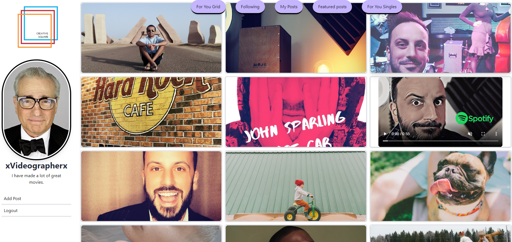

# Creative Square

## Description

### The Portfolio App with a Social Focus

Creative Square is a social media forward portfolio application. It is designed to take the most engaging and direct approach for your content as a creator to be consumed and financially contributed to.

   

## Table of Contents

- [Installation](#installation)
- [Usage](#usage)

- [Credits](#credits)

- [Licenses](#license)

## Usage

Click <a href ="https://creative-square.herokuapp.com/">here</a> to join!

## Credits

Node.js, MongoDB, GraphQL, Mongoose, Apollo, React, TailwindCSS

## License

## Github

#### <a href="https://www.github.com/jrsparl">John Sparling</a>

#### <a href="https://www.github.com/napo-100">Michael Napolitano</a>

#### <a href="https://www.github.com/johngeorge88">John Awad</a>

#### <a href="https://www.github.com/aznjp">John Park</a>

## Email

#### john@sparlingmusic.com

#### Michaeljnapolitano@gmail.com

#### johniskandar@hotmail.com

#### jpark103193@gmail.com
